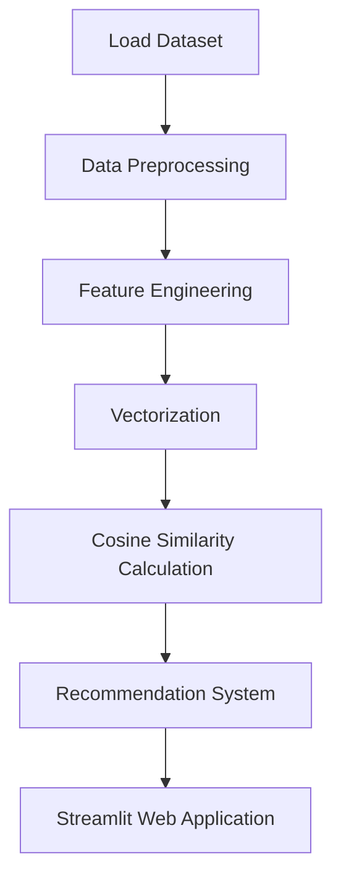

# 🎬 Netflix Movie Recommendation System using Machine Learning


A **Machine Learning-based Movie Recommendation System** that suggests movies similar to the one selected by the user.

This project demonstrates a **complete end-to-end Machine Learning workflow**, including:

* Data preprocessing
* Feature engineering
* Similarity calculation
* Recommendation system
* Web app development
* Model deployment

The application is built using **Streamlit** and deployed online for real-time recommendations.

---

# 🌐 Live Website

🚀 Try the deployed application here:

https://ai-ml-and-ds-projects-ne3p2sm3mnlgcovc8gxzza.streamlit.app/

Users can select any movie and instantly receive **5 recommended movies with posters and details**.

---

# 📌 Project Overview

Movie recommendation systems are widely used by platforms like Netflix, Amazon, and YouTube to improve user experience.

In this project, a **Content-Based Filtering recommendation system** is developed to suggest movies based on **similarity between movie features**.

The system analyzes movie attributes such as:

* Genres
* Keywords
* Cast
* Crew
* Movie overview

and recommends movies that are **most similar to the selected movie**.

---

# 🧠 Machine Learning Pipeline



This represents the **complete ML lifecycle implemented in the project**.

---

# 📊 Dataset Information

Dataset: **TMDB Movie Dataset**

| Feature  | Description             |
| -------- | ----------------------- |
| movie_id | Unique movie identifier |
| title    | Movie title             |
| genres   | Movie genres            |
| keywords | Movie keywords          |
| cast     | Main actors             |
| crew     | Director and crew       |
| overview | Movie description       |

These features are combined to create a **content-based recommendation model**.

---

# ⚙️ Technologies Used

* **Python**
* **Pandas**
* **NumPy**
* **Scikit-Learn**
* **Streamlit**
* **Requests**
* **Pickle**
* **Jupyter Notebook**

---

# 🤖 Machine Learning Model Used

The project uses **Content-Based Filtering**.

The algorithm calculates similarity between movies using **Cosine Similarity**.

Steps involved:

1️⃣ Combine important movie features
2️⃣ Convert text features into vectors
3️⃣ Calculate cosine similarity
4️⃣ Recommend top similar movies

---

# 📈 Model Evaluation

The system recommends **Top 5 movies** based on similarity score.

Each recommendation includes:

* Movie poster
* Movie title
* Movie rating
* Release date
* Movie overview

Movie posters are fetched dynamically using the **TMDB API**.

---

# 📊 Data Visualization

Data analysis and visualization include:

* Feature extraction
* Text vectorization
* Similarity matrix analysis

Libraries used:

* **Pandas**
* **NumPy**
* **Scikit-Learn**

---

# 🔍 Recommendation System

The trained system works as follows:

```
Input → Movie Title
Output → Top 5 Similar Movies
```

The system searches the similarity matrix and returns movies with **highest similarity scores**.

---

# 🌍 Real World Applications

Recommendation systems like this are widely used in:

* Movie streaming platforms
* E-commerce recommendation systems
* Music streaming platforms
* Content discovery platforms
* Personalized recommendation engines

Companies like Netflix, Amazon, and Spotify rely heavily on recommendation algorithms.

---

# 📂 Project Structure

```
Netflix-Movie-Recommendation-System
│
├── NETFLIX.ipynb
├── app.py
├── movies_dict.pkl
├── similarity.pkl
├── requirements.txt
├── README.md
```

---

# 🚀 How to Run the Project

### 1️⃣ Clone the repository

```bash
git clone https://github.com/your-username/netflix-movie-recommendation-system.git
```

### 2️⃣ Navigate to the folder

```bash
cd netflix-movie-recommendation-system
```

### 3️⃣ Install dependencies

```bash
pip install -r requirements.txt
```

### 4️⃣ Run the Streamlit app

```bash
streamlit run app.py
```

The application will open in your browser.

---

# 🎯 Skills Demonstrated

* Data preprocessing
* Feature engineering
* Natural language processing basics
* Cosine similarity algorithm
* Machine learning model development
* API integration
* Web app development
* Model deployment

---

# 📸 Example Output

The recommendation system predicts:

```
Input → Movie Title
Output → Top 5 Similar Movies with Posters
```

---

# 👨‍💻 Author

**Taksh Samirkumar Patel**

Computer Science Engineering Student
Interested in **Artificial Intelligence | Machine Learning | Data Science**

🔗 LinkedIn
https://www.linkedin.com/in/taksh-patel-6a6b97325

💻 LeetCode
https://leetcode.com/u/5EWSbJZA6M/

---

⭐ If you found this project useful, consider giving it a **star on GitHub!**
